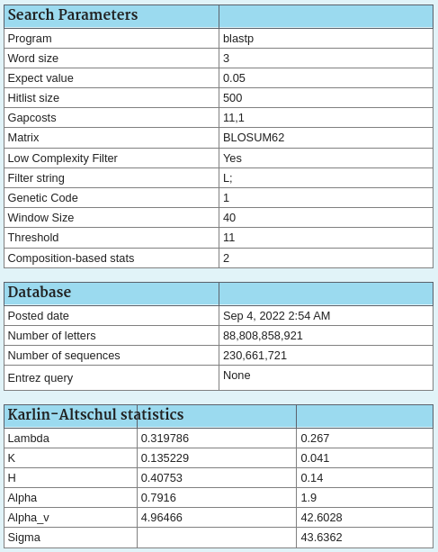

I used NCBI blast to search the query QWE88920.1 against the refseq_protein database as of 2022-09-15. Search parameters are shown below:

I selected the top 20 hits sorted by E-value, downloaded their complete sequences as a FASTA, and imported them into Jalview. I then fetched the Uniprot record for the SARS-CoV2 spike protein (P0DTC2) and aligned all the sequences using MUSCLE within Jalview. I also fetched the 3D structure of the Uniprot entry and added the annotation via "add reference annotation" for the entry. The Jalview project file is saved for easy manipulation later.
